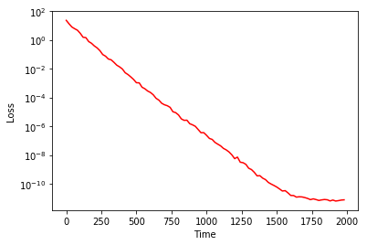
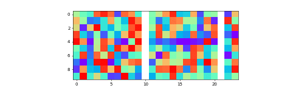
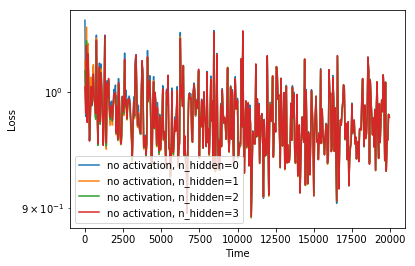
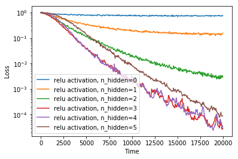
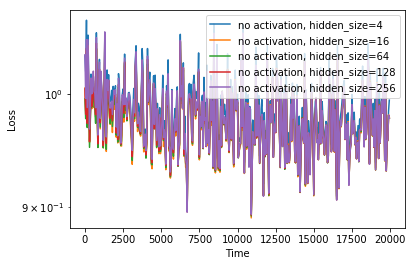
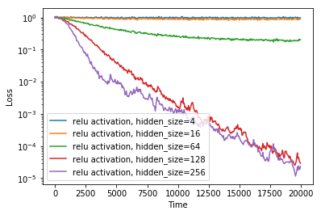

[返回目录](01-content.md)
# 第四章：常见的神经网络层
## 1. 线性层
### 1.1 什么是线性层
什么是线性层？顾名思义，线性层即进行一个线性运算的层。假定输入数据是一个张量 $X_{I,J,K}$ , 输出数据是一个张量 $Y_{I, L}$ 。这里的大写下标代表张量每个维度的尺寸。我们可以引入如下线性运算，来实现张量 $X$ 到 $Y$ 的映射：$$X_{I,J,K} W_{J,K,L}+B_{I, L}=Y_{I, L}$$ 。在实践中，这里的第一个维度(尺寸为 $I$ )，一般是 最小训练集的尺寸（batch size），$J,K$ 所对应的两个维度将缩并（矩阵内积）。线性层是最简单的神经网络层之一。根据普适近似定理（Universal approximation theorem）[^uat]，当我们把多个被有界并单调递增的函数（一般是激活函数）包裹起来的线性层嵌套叠加起来的时候，只要层数足够多，其就能用来以任意精度拟合任意函数。当层度比较多时，我们就得到一个深层神经网络（Deep Neural Network）。

[^uat]: [维基百科：普适近似定理（Universal approximation theorem）](https://en.wikipedia.org/wiki/Universal_approximation_theorem)

接下来，我们进一步分析其到底是什么意思。我们用小写下标来代表该张量的元素位置编号。例如，$X_{i,j,k}$ 代表 $X$ 的第 $(i, j, k)$ 号元素的值。如此，我们有：$$Y_{i,l}= \sum_{j,k} X_{i,j,k}*W_{j,k,l} + B_{i,l}$$ 在进一步分析之前，我们先验证一个结果：单纯改变张量形状，不会改变运算结果。例如，我们将 $X_{I,J,K}$ 的第2、3维度合并写成 $X'_{I,N}$ ，将 $W_{J,K,L}$ 的第1、2维度合并写成 $W'_{N,L}$ ，将不改变计算结果（这里，$N=J+K$ 。因此： $$Y_{i,l}= \sum_{n} X'_{n,k}*W'_{n,l} + B_{i,l},$$ 
为了简化起见，我们不作数学证明，只是给出验证代码。代码如下：

```python
import numpy as np
np.random.seed(1) 

X = np.random.randint(0,10,[2,3,4])
W = np.random.randint(0,10,[3,4,5])
print('X=\n{}'.format(X))
print('W=\n{}'.format(W))
print('X.W=\n{}'.format(np.tensordot(X,W,[[1,2],[0,1]])))

X1 = X.reshape([2,-1])
W1 = W.reshape([-1,5])
print('X1\n={}'.format(X1))
print('W1\n={}'.format(W1))
print('X1.W1\n={}'.format(np.tensordot(X1,W1,[[-1],[0]])))
```
运行后，生成结果如下：

```
X=
[[[5 8 9 5]
  [0 0 1 7]
  [6 9 2 4]]

 [[5 2 4 2]
  [4 7 7 9]
  [1 7 0 6]]]
W=
[[[9 9 7 6 9]
  [1 0 1 8 8]
  [3 9 8 7 3]
  [6 5 1 9 3]]

 [[4 8 1 4 0]
  [3 9 2 0 4]
  [9 2 7 7 9]
  [8 6 9 3 7]]

 [[7 4 5 9 3]
  [6 8 0 2 7]
  [7 9 7 3 0]
  [8 7 7 1 1]]]
X.W=
[[317 337 262 312 294]
 [340 356 266 213 291]]
X1=
[[5 8 9 5 0 0 1 7 6 9 2 4]
 [5 2 4 2 4 7 7 9 1 7 0 6]]
W1=
[[9 9 7 6 9]
 [1 0 1 8 8]
 [3 9 8 7 3]
 [6 5 1 9 3]
 [4 8 1 4 0]
 [3 9 2 0 4]
 [9 2 7 7 9]
 [8 6 9 3 7]
 [7 4 5 9 3]
 [6 8 0 2 7]
 [7 9 7 3 0]
 [8 7 7 1 1]]
X1.W1=
[[317 337 262 312 294]
 [340 356 266 213 291]]
```
以上例子中， $X.W=X1.W1$ 。这个例子告诉我们，单纯通过改变张量形状，以增加张量的维度，并不能增加网络的复杂度（或信息存储能力）。

此外，不将线性层套入任何非线性激活函数，而是单纯地增加神经网络层数，也无法增加神经网络的复杂度。原因如下推倒所示： $$(XW'+B')W'' +B' = X(W'W'') + (B'W''+B'') $$ 
假如我们定义 $W=W'W''$ ，以及 $B'W''+B'=B$ ，那么，形式上退化为 $XW+B$ ，并未增加网络复杂度（或信息存储能力）。因此，非线性是增加网络复杂度（例如构建深度学习神经网络）的关键。

在接下来的章节，我们将用 pytorch 自己构建一个线性神经网络，为研究其其余特性做准备。
### 1.2 手把手构建一个线性层
接下来我们来手把手构建一个线性层。pytorch 给我提供了很方便的自动求梯度的工具，从而不需要手动计算参数的梯度计算式。按照其规范定义的神经网络层，在求解问题时，还可以直接调用其现有的随机优化算法。然而这要求我们依照 pytorch 的规范去定义函数和神经网络层。为了方便理解，我们采用三种不同的方式构建一个线性层：1）土办法，2）拓展 torch.autograd.Function， 3）拓展 torch.nn.Module。
#### 1） 土办法
土办法是方便理解，虽然可以利用 pytorch 的张量的自动求梯度的功能，但不能简单地利用 pytorch 提供的优化器对参数自动进行优化。由于有这个缺陷，因此需要我们手动编写一个优化器 [ 简便起见，我们采用随机梯度递减算法（SGD），详细讨论请参见[第四章](4-optimization_algorithms.md)]。根据前边的讨论，增加张量维度，并不能增加网络复杂度，因此，简单起见，我们只考虑二维矩阵情况： $X_{N,I}W_{I,J}=Y_{J}$ , 其中 $N$ 是`batch_size`， $I$ 是 `input_size`， $J$ 是`output_size` 完整代码和注释如下：

```python
# 导入模块
%matplotlib inline
import torch
import numpy as np
import pylab as pl
from torch import nn

# 定义线性层
class Linear_DIY():
    def __init__(self, input_size, output_size):
        self.input_size = input_size # 对应前文的 I
        self.output_size = output_size # 对应前文的 J
        self.weight = nn.Parameter(torch.randn(input_size, output_size)) # 对应前文的 W
        self.bias = nn.Parameter(torch.randn(output_size)) # 对应前文的 B
    def __call__(self, x):
        self.input = x
        self.output = torch.mm(self.input,self.weight) # X.W
        self.output += self.bias.unsqueeze(0).expand_as(self.output) # X.W+B
        return self.output
    def step(self, lr=1e-3):
        self.weight.data -= lr * self.weight.grad  # 对W进行随机梯度递减操作
        self.bias.data -= lr * self.bias #  对B进行随机梯度递减操作
        self.weight.grad.data.zero_() # 归零梯度（pytorch 要求有这个操作，因为梯度存储的是每次后向传递的累积梯度）
        self.bias.grad.data.zero_()  # 归零梯度
        
lr = 1e-2 # 学习率
batch_size = 5 # batch 尺寸
input_size = 10 
output_size = 2

torch.manual_seed(1)
np.random.seed(1)

# 生成一组满足 X.W = Y 的随机数据用于训练，通过拟合的形式，找出这个预设的W 以及B （这里假定B=0）
data_size = 500 # 随机数据的样本数
x_data = torch.randn(data_size,input_size) # 数据X
W = torch.randn(input_size,output_size) # 预设的 W
y_data = torch.mm(x_data,W) # 数据 Y

linear = Linear_DIY(input_size, output_size) # 初始化线性层

Losses = [] # 用于记录随时间变化的损失

n_epochs= 2000 # 优化迭代总时间步数

for epoch in range(n_epochs): 
    sample_indices = np.random.randint(0,data_size,batch_size) # 随机采样，以形成一个batch
    x = x_data[sample_indices] # 采样得到的X 的一个batch
    x = linear(x)
    y = y_data[sample_indices] # 采样得到的Y 的一个batch
    loss = torch.mean((x-y)**2) # 均方差 （MSE）
    loss.backward() # 将损失的梯度向后传递
    Losses.append(loss.detach().tolist()) # 记录损失值
    linear.step(lr=lr) # 进行一步 SGD 优化
    
# 绘图显示损失随时间步数的变化
window_size = 20 # 移动时间窗口大小，我们每 window_size 步绘制一个数据点，用这个窗口内的平均值来绘制。

pl.plot(np.arange(0,len(Losses),window_size),torch.mean(torch.reshape(torch.Tensor(Losses),[-1,window_size]),1).numpy(),'r-')
pl.xlabel('Time')
pl.ylabel('Loss')
pl.yscale('log')
```
运行结果如下：



#### 2) 基于 autograd.Function 构建
(Todo)
#### 3) 基于 nn.Module 构建
代码如下：

```python
# 定义一个线性层
class Linear(nn.Module):
    def __init__(self, input_features, output_features, bias=True):
        super(Linear, self).__init__()
        self.input_features = input_features
        self.output_features = output_features

        # nn.Parameter 
        self.weight = nn.Parameter(torch.Tensor(output_features, input_features))
        if bias:
            self.bias = nn.Parameter(torch.Tensor(output_features))
        else:
            # You should always register all possible parameters, but the
            # optional ones can be None if you want.
            self.register_parameter('bias', None)

        # Not a very smart way to initialize weights
        self.weight.data.uniform_(-0.1, 0.1)
        if bias is not None:
            self.bias.data.uniform_(-0.1, 0.1)

    def forward(self, input):
        # See the autograd section for explanation of what happens here.
        return LinearFunction.apply(input, self.weight, self.bias)

    def extra_repr(self):
        # (Optional)Set the extra information about this module. You can test
        # it by printing an object of this class.
        return 'in_features={}, out_features={}, bias={}'.format(
            self.in_features, self.out_features, self.bias is not None
        )
```

### 1.3 线性层运用和特点探讨
#### 1）权重矩阵随时间的演化
接下来，我们来探讨，线性层的表现与广度和深度之间的关系。我们先考虑三个线性层，看其权重矩阵如何随时间变化。代码如下：

```python
lr = 1e-3
batch_size = 5
input_size = 10
output_size = 2
hidden_size = 10
data_size = 500

torch.manual_seed(1)
np.random.seed(1)

x_data = torch.randn(data_size,input_size) # the x dataset
W = torch.randn(input_size,output_size)
y_data = torch.mm(x_data,W)

class Dense(nn.Module):
    def __init__(self,input_size, output_size, hidden_size, n_hidden=1):
        super(Dense,self).__init__()
        self.input = nn.Linear(input_size, hidden_size)
        hiddens = []
        self.n_hidden = n_hidden
        for n in range(self.n_hidden):
            hiddens.append(nn.Linear(hidden_size, hidden_size))
        self.hiddens = nn.Sequential(*hiddens)
        self.output = nn.Linear(hidden_size, output_size)
    def forward(self,x):
        x = self.input(x)
        for i in range(self.n_hidden):
            x = self.hiddens[i](x)
        return self.output(x)

model = Dense(input_size, output_size, hidden_size, n_hidden=1)
optimizer = torch.optim.SGD(model.parameters(),lr=lr)
loss_func = torch.nn.MSELoss()
Losses = []
display_interval = 50

W_all = [] # 记录各层权重矩阵随时间的变化
for epoch in range(5000):
    model.zero_grad()
    sample_indices = np.random.randint(0,data_size,batch_size)
    x = x_data[sample_indices]
    x = model(x)
    y = y_data[sample_indices]
    loss = loss_func(x,y)
    loss.backward()
    Losses.append(loss.detach().tolist())
    if epoch % display_interval == 0:
        params = [param.detach().numpy().copy() for param in model.parameters()]
        W_all.append(np.concatenate([params[0],np.zeros([hidden_size,1]),params[2].T,np.zeros([hidden_size,1]),params[4].T],1))
    optimizer.step()
window_size = 20
pl.plot(np.arange(0,len(Losses),window_size),np.array(Losses).reshape([-1,window_size]).mean(1),'r-')
pl.xlabel('Time')
pl.ylabel('Loss')
pl.yscale('log')
```

运行结果如下：


接下来，我们来绘制三个线性层随时间的变化图：


```python
from utils import animate
animate(W_all,'W_all.gif',figsize=(10,3))
```

代码运行结果如下：



其中，三层网络的权重矩阵从左到右排开。上图显示，三个权重矩阵同时随时间演化，最后趋于稳定，但是没有发现有什么特别的。

#### 2）神经网络广度与深度的影响
根据普适近似理论，大致来讲，当神经元个数越多时，神经网络的表现力也越强。然而，实践中，并非网络越大越好。网络越大，训练难度也往往越大。此外，也可能导致过拟合问题。

我们先探讨网络深度对训练效果的影响，代码如下:

```python

# 参数的定义
lr = 1e-3
batch_size = 5
input_size = 10
output_size = 10
hidden_size = 128
data_size = 500
n_epochs = 20000
display_interval = 50
n_hidden = 3
activation = None  # torch.relu

# 固定随机数生成器的初始状态，以保证结果可重复性
torch.manual_seed(1)
np.random.seed(1)

# 随机生成训练数据集
x_data = torch.randn(data_size,input_size) # 输入数据集
y_data = torch.randn(data_size,output_size) # 目标数据集

# 定义一个允许有任意层数隐藏层的深层神经网络
class DNN(nn.Module):
    def __init__(self, input_size, output_size, hidden_size, n_hidden=1, activation=None):
        super(DNN,self).__init__()
        self.input = nn.Linear(input_size, hidden_size)
        hiddens = []
        self.n_hidden = n_hidden
        self.activation = activation
        for n in range(self.n_hidden):
            hiddens.append(nn.Linear(hidden_size, hidden_size))
        self.hiddens = nn.Sequential(*hiddens)
        self.output = nn.Linear(hidden_size, output_size)
    def forward(self, x):
        x = self.input(x)
        if self.activation is not None:
            x = self.activation(x)
        for i in range(self.n_hidden):
            x = self.hiddens[i](x)
            if self.activation is not None:
                x = self.activation(x)
        return self.output(x)

# 模型初始化
model = DNN(input_size, output_size, hidden_size, n_hidden=n_hidden, activation=activation)

# 定义一个模型优化器
optimizer = torch.optim.Adam(model.parameters(), lr=lr)

# 定义一个函数，每调用一次下边定义的学习率控制器，当前学习率就等于初始学习率（lr）乘以这个函数的返回值。
def lr_lambda(epoch):
    return 0.99**(epoch/50.0) # 可以是其他形式，具体哪种形式最好，用实践去判断

# 定义一个学习率控制器，用于
scheduler = torch.optim.lr_scheduler.LambdaLR(optimizer, lr_lambda, last_epoch=-1)

# 定义一个Mean Square Error 损失函数
loss_func = torch.nn.MSELoss()

Losses = [] # 记录损失随时间的变化

# 开始训练
for epoch in range(n_epochs):
    model.zero_grad() # 梯度归零
    sample_indices = np.random.randint(0,data_size,batch_size) # 对数据进行随机采样
    x = x_data[sample_indices]
    x = model(x)
    y = y_data[sample_indices]
    loss = loss_func(x,y)
    loss.backward()
    Losses.append(loss.detach().tolist())
    optimizer.step()
    scheduler.step()
    if epoch % 500 == 0: print('Epoch {}'.format(epoch))
window_size = 50 # 每50步绘制一个点，用50步的平均损失来绘制
pl.plot(np.arange(0,len(Losses),window_size),np.array(Losses).reshape([-1,window_size]).mean(1),'r-')
pl.xlabel('Time')
pl.ylabel('Loss')
pl.yscale('log')
```

通过固定其他参数为如上代码所示，并调节 `n_hidden_layers`, 以及加上和去掉损失函数(`torch.relu`)，我们可以对比其损失随时间的变化情况。结果如下图所示：


上图结果表明，在没有加入非线性激活函数的情况下，增加网络深度（层数）并不能增加网络的表达能力。而在加入非线性激活函数后，网络的表现能力随着层数的增加而加强。然而，这种增强效果，在深度增加到一定程度的时候，会趋于饱和，之后，再增加深度，网络的表达能力的增加不明显，甚至出现反弹（如本例中所示，`n_hidden=5` 的训练效果，还不如 `n_hidden=3`）。

接下来，我们研究网络的广度对训练结果的影响。我们可以通过固定其他参数为上图所示，然后调节`hidden_size`，并区分是否有损失函数(`torch.relu`)两种情况，进行对比研究。结果如下图所示：




上图发现，对于没有激活层的神经网络，增加神经网络的广度也无法弥补起表达能力不足的缺陷。可见，非线性激活函数非常重要（关于激活函数的更多对比讨论，请参见本章的第5节）。对于加了激活层的神经网络，当增加隐藏层的广度的时候，表达能力明显增强。然而，这种增强效果也会趋于饱和。很显然，所需的广度是因不同的数据集而异的。信息量越大，所需要的广度也是越大的。但广度的增加，也会导致优化速度明显降低，也有可能导致过拟合。广度值具体设置为多少，则需要反复尝试，通过查看优化效果来判断。

## 2. 递归层
### 1.1 什么是递归层
### 1.2 手把手构建一个递归层
### 1.3 递归层运用和特点探讨
## 3. 卷积层
### 1.1 什么是卷积层
### 1.2 手把手构建一个卷积层
### 1.3 卷积层运用和特点探讨
## 4. 采样层
### 1.1 什么是采样层
### 1.2 手把手构建一个采样层
### 1.3 采样层运用和特点探讨
## 5. 激活层
### 1.1 什么是激活层
### 1.2 手把手构建一个激活层
### 1.3 激活层运用和特点探讨
## 6. 归一层
### 1.1 什么是归一层
### 1.2 手把手构建一个归一层
### 1.3 归一层运用和特点探讨
## 7. 填充层
### 1.1 什么是填充层
### 1.2 手把手构建一个填充层
### 1.3 填充层运用和特点探讨
## 8. 丢弃层
### 1.1 什么是丢弃层
### 1.2 手把手构建一个丢弃层
### 1.3 丢弃层运用和特点探讨