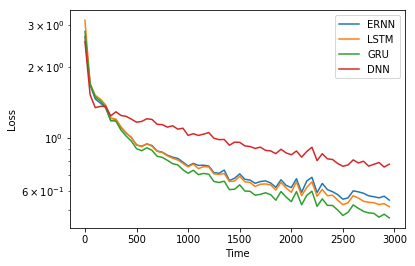
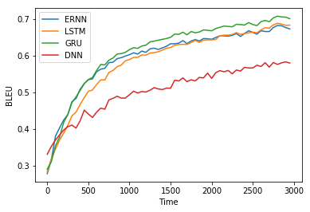

[返回目录](01-content.md)
# 第二章：常见的神经网络层
## 1. 线性层
### 1.1 什么是线性层
什么是线性层？顾名思义，线性层即进行一个线性运算的层。假定输入数据是一个张量 $X_{I,J,K}$ , 输出数据是一个张量 $Y_{I, L}$ 。这里的大写下标代表张量每个维度的尺寸。我们可以引入如下线性运算，来实现张量 $X$ 到 $Y$ 的映射：$$X_{I,J,K} W_{J,K,L}+B_{I, L}=Y_{I, L}$$ 。在实践中，这里的第一个维度(尺寸为 $I$ )，一般是 最小训练集的尺寸（batch size），$J,K$ 所对应的两个维度将缩并（矩阵内积）。线性层是最简单的神经网络层之一。根据普适近似定理（Universal approximation theorem）[^uat]，当我们把多个被有界并单调递增的函数（一般是激活函数）包裹起来的线性层嵌套叠加起来的时候，只要层数足够多，其就能用来以任意精度拟合任意函数。当层度比较多时，我们就得到一个深层神经网络（Deep Neural Network）。

[^uat]: [维基百科：普适近似定理（Universal approximation theorem）](https://en.wikipedia.org/wiki/Universal_approximation_theorem)

接下来，我们进一步分析其到底是什么意思。我们用小写下标来代表该张量的元素位置编号。例如，$X_{i,j,k}$ 代表 $X$ 的第 $(i, j, k)$ 号元素的值。如此，我们有：$$Y_{i,l}= \sum_{j,k} X_{i,j,k}*W_{j,k,l} + B_{i,l}$$ 在进一步分析之前，我们先验证一个结果：单纯改变张量形状，不会改变运算结果。例如，我们将 $X_{I,J,K}$ 的第2、3维度合并写成 $X'_{I,N}$ ，将 $W_{J,K,L}$ 的第1、2维度合并写成 $W'_{N,L}$ ，将不改变计算结果（这里，$N=J+K$ 。因此： $$Y_{i,l}= \sum_{n} X'_{n,k}*W'_{n,l} + B_{i,l},$$ 
为了简化起见，我们不作数学证明，只是给出验证代码。代码如下：

```python
import numpy as np
np.random.seed(1) 

X = np.random.randint(0,10,[2,3,4])
W = np.random.randint(0,10,[3,4,5])
print('X=\n{}'.format(X))
print('W=\n{}'.format(W))
print('X.W=\n{}'.format(np.tensordot(X,W,[[1,2],[0,1]])))

X1 = X.reshape([2,-1])
W1 = W.reshape([-1,5])
print('X1\n={}'.format(X1))
print('W1\n={}'.format(W1))
print('X1.W1\n={}'.format(np.tensordot(X1,W1,[[-1],[0]])))
```
运行后，生成结果如下：

```
X=
[[[5 8 9 5]
  [0 0 1 7]
  [6 9 2 4]]

 [[5 2 4 2]
  [4 7 7 9]
  [1 7 0 6]]]
W=
[[[9 9 7 6 9]
  [1 0 1 8 8]
  [3 9 8 7 3]
  [6 5 1 9 3]]

 [[4 8 1 4 0]
  [3 9 2 0 4]
  [9 2 7 7 9]
  [8 6 9 3 7]]

 [[7 4 5 9 3]
  [6 8 0 2 7]
  [7 9 7 3 0]
  [8 7 7 1 1]]]
X.W=
[[317 337 262 312 294]
 [340 356 266 213 291]]
X1=
[[5 8 9 5 0 0 1 7 6 9 2 4]
 [5 2 4 2 4 7 7 9 1 7 0 6]]
W1=
[[9 9 7 6 9]
 [1 0 1 8 8]
 [3 9 8 7 3]
 [6 5 1 9 3]
 [4 8 1 4 0]
 [3 9 2 0 4]
 [9 2 7 7 9]
 [8 6 9 3 7]
 [7 4 5 9 3]
 [6 8 0 2 7]
 [7 9 7 3 0]
 [8 7 7 1 1]]
X1.W1=
[[317 337 262 312 294]
 [340 356 266 213 291]]
```
以上例子中， $X.W=X1.W1$ 。这个例子告诉我们，单纯通过改变张量形状，以增加张量的维度，并不能增加网络的复杂度（或信息存储能力）。

此外，不将线性层套入任何非线性激活函数，而是单纯地增加神经网络层数，也无法增加神经网络的复杂度。原因如下推倒所示： $$(XW'+B')W'' +B' = X(W'W'') + (B'W''+B'') $$ 
假如我们定义 $W=W'W''$ ，以及 $B'W''+B'=B$ ，那么，形式上退化为 $XW+B$ ，并未增加网络复杂度（或信息存储能力）。因此，非线性是增加网络复杂度（例如构建深度学习神经网络）的关键。

在接下来的章节，我们将用 pytorch 自己构建一个线性神经网络，为研究其其余特性做准备。
### 1.2 手把手构建一个线性层
接下来我们来手把手构建一个线性层。pytorch 给我提供了很方便的自动求梯度的工具，从而不需要手动计算参数的梯度计算式。按照其规范定义的神经网络层，在求解问题时，还可以直接调用其现有的随机优化算法。然而这要求我们依照 pytorch 的规范去定义函数和神经网络层。为了方便理解，我们采用三种不同的方式构建一个线性层：1）土办法，2）拓展 torch.autograd.Function， 3）拓展 torch.nn.Module。
#### 1） 土办法
土办法是方便理解，虽然可以利用 pytorch 的张量的自动求梯度的功能，但不能简单地利用 pytorch 提供的优化器对参数自动进行优化。由于有这个缺陷，因此需要我们手动编写一个优化器 [ 简便起见，我们采用随机梯度递减算法（SGD），详细讨论请参见[第四章](4-optimization_algorithms.md)]。根据前边的讨论，增加张量维度，并不能增加网络复杂度，因此，简单起见，我们只考虑二维矩阵情况： $X_{N,I}W_{I,J}=Y_{J}$ , 其中 $N$ 是`batch_size`， $I$ 是 `input_size`， $J$ 是`output_size` 完整代码和注释如下：

```python
# 导入模块
%matplotlib inline
import torch
import numpy as np
import pylab as pl
from torch import nn

# 定义线性层
class Linear_DIY():
    def __init__(self, input_size, output_size):
        self.input_size = input_size # 对应前文的 I
        self.output_size = output_size # 对应前文的 J
        self.weight = nn.Parameter(torch.randn(input_size, output_size)) # 对应前文的 W
        self.bias = nn.Parameter(torch.randn(output_size)) # 对应前文的 B
    def __call__(self, x):
        self.input = x
        self.output = torch.mm(self.input,self.weight) # X.W
        self.output += self.bias.unsqueeze(0).expand_as(self.output) # X.W+B
        return self.output
    def step(self, lr=1e-3):
        self.weight.data -= lr * self.weight.grad  # 对W进行随机梯度递减操作
        self.bias.data -= lr * self.bias #  对B进行随机梯度递减操作
        self.weight.grad.data.zero_() # 归零梯度（pytorch 要求有这个操作，因为梯度存储的是每次后向传递的累积梯度）
        self.bias.grad.data.zero_()  # 归零梯度
        
lr = 1e-2 # 学习率
batch_size = 5 # batch 尺寸
input_size = 10 
output_size = 2

torch.manual_seed(1)
np.random.seed(1)

# 生成一组满足 X.W = Y 的随机数据用于训练，通过拟合的形式，找出这个预设的W 以及B （这里假定B=0）
data_size = 500 # 随机数据的样本数
x_data = torch.randn(data_size,input_size) # 数据X
W = torch.randn(input_size,output_size) # 预设的 W
y_data = torch.mm(x_data,W) # 数据 Y

linear = Linear_DIY(input_size, output_size) # 初始化线性层

Losses = [] # 用于记录随时间变化的损失

n_epochs= 2000 # 优化迭代总时间步数

for epoch in range(n_epochs): 
    sample_indices = np.random.randint(0,data_size,batch_size) # 随机采样，以形成一个batch
    x = x_data[sample_indices] # 采样得到的X 的一个batch
    x = linear(x)
    y = y_data[sample_indices] # 采样得到的Y 的一个batch
    loss = torch.mean((x-y)**2) # 均方差 （MSE）
    loss.backward() # 将损失的梯度向后传递
    Losses.append(loss.detach().tolist()) # 记录损失值
    linear.step(lr=lr) # 进行一步 SGD 优化
    
# 绘图显示损失随时间步数的变化
window_size = 20 # 移动时间窗口大小，我们每 window_size 步绘制一个数据点，用这个窗口内的平均值来绘制。

pl.plot(np.arange(0,len(Losses),window_size),torch.mean(torch.reshape(torch.Tensor(Losses),[-1,window_size]),1).numpy(),'r-')
pl.xlabel('Time')
pl.ylabel('Loss')
pl.yscale('log')
```
运行结果如下：


#### 2) 基于 autograd.Function 构建
本节我们通过拓展 `torch.autograd.Function` 模块来构建一个线性变换模块。构建时，我们要在该模块内定义两个函数：一个`forward` 和一个`backward`。前者输入$X$、$W$和$B$，然后输出一个 $Y$ 张量。其中 $Y=XM+B$ 。后者输入的是由上游损失函数传递下来，相对于 $Y$ 的梯度，输出的是三个输入变量的梯度。假定损失函数为 $L$ ，通过 backpropagate 传递到 $Y$ 的梯度为 $\frac{\partial L}{\partial Y}$，那么， 
$$\frac{\partial L}{\partial X_{i,j}} = \sum_{k,l}\frac{\partial L}{\partial Y_{k,l}}\frac{\partial Y_{k,l}}{\partial X_{i,j}}$$ $$= \sum_{k,l}\frac{\partial L}{\partial Y_{k,l}}\frac{\partial (\sum_{m}X_{k,m}W_{m,l}+B_{k,l})}{\partial X_{i,j}}$$ $$=  \sum_{k,l}\frac{\partial L}{\partial Y_{k,l}}\sum_{m}W_{m,l} \delta_{k,i}\delta_{m,j}$$ $$= \sum_l \frac{\partial L}{\partial Y_{i,l}}W_{j,l}$$ $$= \frac{\partial L}{\partial Y}W^{T}$$ 类似地，我们可以得到 $$\frac{\partial L}{\partial W} = X^T \frac{\partial L}{\partial Y}$$ 以及
$$\frac{\partial L}{\partial B} = \frac{\partial L}{\partial Y}$$ 。然而，需要注意的是 bias 项的话，对于不同的 batch（每一个 batch 对应一行） 有相同的值，因此，我们可以用所有行的平均（或者求和）值来代替之。因此，$ \frac{\partial L}{\partial B}:=\frac{\partial L}{\partial B_{,j}} = \sum_{i}\frac{\partial L}{\partial Y_{i,j}}$ 。如下是实现的代码：

```python 
from torch.autograd import Function
from torch import nn
import torch
import numpy as np
# Inherit from Function
class LinearFunction(Function):
    def __call__(self, x):
        return self.apply(x)

    # 注意：backward 和 forward 函数都是 @staticmethods
    @staticmethod
    # bias 是一个可选参数
    def forward(ctx, input, weight, bias=None):
        ctx.save_for_backward(input, weight, bias) # 保存变量，用于更新梯度
        output = input.mm(weight.t())
        if bias is not None:
            output += bias.unsqueeze(0).expand_as(output) # 为每一个batch复制一份相同的bias
        return output

    # 这个函数只有一个输出：Y, 因此，只有一个从上游返回的梯度张量
    @staticmethod
    def backward(ctx, grad_output):
    	# 读取之前存储变量值，并将其梯度全部初始为None
        input, weight, bias = ctx.saved_tensors
        grad_input = grad_weight = grad_bias = None

        if ctx.needs_input_grad[0]: # 检查第一个参数是否需要更新梯度
            grad_input = grad_output.mm(weight.t()) # dL/dX 参见前文推导
        if ctx.needs_input_grad[1]:  
            grad_weight = input.t().mm(grad_output.t()) # dL/dW
        if bias is not None and ctx.needs_input_grad[2]:
            grad_bias = grad_output.mean(0).squeeze(0) # dL/dB

        return grad_input, grad_weight, grad_bias
```

#### 3) 基于 nn.Module 构建
以上代码提供了一个可以自动计算梯度的线性变换运算，将$X$ 变换为 $Y$。接下来，我们要把这个运算封装成一个神经网络层。其代码如下：

```python
# 定义一个线性层
class Linear(nn.Module):
    def __init__(self, input_features, output_features, bias=True):
        super(Linear, self).__init__()
        self.input_features = input_features
        self.output_features = output_features

        # nn.Parameter 
        self.weight = nn.Parameter(torch.Tensor(input_features, output_features))
        if bias:
            self.bias = nn.Parameter(torch.Tensor(output_features))
        else:
            # 注意：必须将所有的可训练参数注册，即便没有被使用。
            # 对于可选参数，你可以将其注册为 None，但不能不注册
            self.register_parameter('bias', None)

        # 初始化参数值
        self.weight.data.uniform_(-0.1, 0.1)
        if bias is not None:
            self.bias.data.uniform_(-0.1, 0.1)

    def forward(self, input):
        # 计算Y = XM+B
        return LinearFunction.apply(input, self.weight, self.bias)
    
    def extra_repr(self):
        # (可选) 设置关于这个模块的额外信息，可以通过 print 来查看
        return 'in_features={}, out_features={}, bias={}'.format(
            self.in_features, self.out_features, self.bias is not None
        )
```

### 1.3 线性层运用和特点探讨
#### 1）权重矩阵随时间的演化
接下来，我们来探讨，线性层的表现与广度和深度之间的关系。我们先考虑三个线性层，看其权重矩阵如何随时间变化。代码如下：

```python
lr = 1e-3
batch_size = 5
input_size = 10
output_size = 2
hidden_size = 10
data_size = 500

torch.manual_seed(1)
np.random.seed(1)

x_data = torch.randn(data_size,input_size) # the x dataset
W = torch.randn(input_size,output_size)
y_data = torch.mm(x_data,W)

class Dense(nn.Module):
    def __init__(self,input_size, output_size, hidden_size, n_hidden=1):
        super(Dense,self).__init__()
        self.input = nn.Linear(input_size, hidden_size)
        hiddens = []
        self.n_hidden = n_hidden
        for n in range(self.n_hidden):
            hiddens.append(nn.Linear(hidden_size, hidden_size))
        self.hiddens = nn.Sequential(*hiddens)
        self.output = nn.Linear(hidden_size, output_size)
    def forward(self,x):
        x = self.input(x)
        for i in range(self.n_hidden):
            x = self.hiddens[i](x)
        return self.output(x)

model = Dense(input_size, output_size, hidden_size, n_hidden=1)
optimizer = torch.optim.SGD(model.parameters(),lr=lr)
loss_func = torch.nn.MSELoss()
Losses = []
display_interval = 50

W_all = [] # 记录各层权重矩阵随时间的变化
for epoch in range(5000):
    model.zero_grad()
    sample_indices = np.random.randint(0,data_size,batch_size)
    x = x_data[sample_indices]
    x = model(x)
    y = y_data[sample_indices]
    loss = loss_func(x,y)
    loss.backward()
    Losses.append(loss.detach().tolist())
    if epoch % display_interval == 0:
        params = [param.detach().numpy().copy() for param in model.parameters()]
        W_all.append(np.concatenate([params[0],np.zeros([hidden_size,1]),params[2].T,np.zeros([hidden_size,1]),params[4].T],1))
    optimizer.step()
window_size = 20
pl.plot(np.arange(0,len(Losses),window_size),np.array(Losses).reshape([-1,window_size]).mean(1),'r-')
pl.xlabel('Time')
pl.ylabel('Loss')
pl.yscale('log')
```

运行结果如下：


接下来，我们来绘制三个线性层随时间的变化图：


```python
from utils import animate
animate(W_all,'W_all.gif',figsize=(10,3))
```

代码运行结果如下：


其中，三层网络的权重矩阵从左到右排开。上图显示，三个权重矩阵同时随时间演化，最后趋于稳定，但是没有发现有什么特别的。

#### 2）神经网络广度与深度的影响
根据普适近似理论，大致来讲，当神经元个数越多时，神经网络的表现力也越强。然而，实践中，并非网络越大越好。网络越大，训练难度也往往越大。此外，也可能导致过拟合问题。

我们先探讨网络深度对训练效果的影响，代码如下:

```python

# 参数的定义
lr = 1e-3
batch_size = 5
input_size = 10
output_size = 10
hidden_size = 128
data_size = 500
n_epochs = 20000
display_interval = 50
n_hidden = 3
activation = None  # torch.relu

# 固定随机数生成器的初始状态，以保证结果可重复性
torch.manual_seed(1)
np.random.seed(1)

# 随机生成训练数据集
x_data = torch.randn(data_size,input_size) # 输入数据集
y_data = torch.randn(data_size,output_size) # 目标数据集

# 定义一个允许有任意层数隐藏层的深层神经网络
class DNN(nn.Module):
    def __init__(self, input_size, output_size, hidden_size, n_hidden=1, activation=None):
        super(DNN,self).__init__()
        self.input = nn.Linear(input_size, hidden_size)
        hiddens = []
        self.n_hidden = n_hidden
        self.activation = activation
        for n in range(self.n_hidden):
            hiddens.append(nn.Linear(hidden_size, hidden_size))
        self.hiddens = nn.Sequential(*hiddens)
        self.output = nn.Linear(hidden_size, output_size)
    def forward(self, x):
        x = self.input(x)
        if self.activation is not None:
            x = self.activation(x)
        for i in range(self.n_hidden):
            x = self.hiddens[i](x)
            if self.activation is not None:
                x = self.activation(x)
        return self.output(x)

# 模型初始化
model = DNN(input_size, output_size, hidden_size, n_hidden=n_hidden, activation=activation)

# 定义一个模型优化器
optimizer = torch.optim.Adam(model.parameters(), lr=lr)

# 定义一个函数，每调用一次下边定义的学习率控制器，当前学习率就等于初始学习率（lr）乘以这个函数的返回值。
def lr_lambda(epoch):
    return 0.99**(epoch/50.0) # 可以是其他形式，具体哪种形式最好，用实践去判断

# 定义一个学习率控制器，用于
scheduler = torch.optim.lr_scheduler.LambdaLR(optimizer, lr_lambda, last_epoch=-1)

# 定义一个Mean Square Error 损失函数
loss_func = torch.nn.MSELoss()

Losses = [] # 记录损失随时间的变化

# 开始训练
for epoch in range(n_epochs):
    model.zero_grad() # 梯度归零
    sample_indices = np.random.randint(0,data_size,batch_size) # 对数据进行随机采样
    x = x_data[sample_indices]
    x = model(x)
    y = y_data[sample_indices]
    loss = loss_func(x,y)
    loss.backward()
    Losses.append(loss.detach().tolist())
    optimizer.step()
    scheduler.step()
    if epoch % 500 == 0: print('Epoch {}'.format(epoch))
window_size = 50 # 每50步绘制一个点，用50步的平均损失来绘制
pl.plot(np.arange(0,len(Losses),window_size),np.array(Losses).reshape([-1,window_size]).mean(1),'r-')
pl.xlabel('Time')
pl.ylabel('Loss')
pl.yscale('log')
```

通过固定其他参数为如上代码所示，并调节 `n_hidden_layers`, 以及加上和去掉损失函数(`torch.relu`)，我们可以对比其损失随时间的变化情况。结果如下图所示：


上图结果表明，在没有加入非线性激活函数的情况下，增加网络深度（层数）并不能增加网络的表达能力。而在加入非线性激活函数后，网络的表现能力随着层数的增加而加强。然而，这种增强效果，在深度增加到一定程度的时候，会趋于饱和，之后，再增加深度，网络的表达能力的增加不明显，甚至出现反弹（如本例中所示，`n_hidden=5` 的训练效果，还不如 `n_hidden=3`）。

接下来，我们研究网络的广度对训练结果的影响。我们可以通过固定其他参数为上图所示，然后调节`hidden_size`，并区分是否有损失函数(`torch.relu`)两种情况，进行对比研究。结果如下图所示：


上图发现，对于没有激活层的神经网络，增加神经网络的广度也无法弥补起表达能力不足的缺陷。可见，非线性激活函数非常重要（关于激活函数的更多对比讨论，请参见本章的第5节）。对于加了激活层的神经网络，当增加隐藏层的广度的时候，表达能力明显增强。然而，这种增强效果也会趋于饱和。很显然，所需的广度是因不同的数据集而异的。信息量越大，所需要的广度也是越大的。但广度的增加，也会导致优化速度明显降低，也有可能导致过拟合。广度值具体设置为多少，则需要反复尝试，通过查看优化效果来判断。

## 2. 递归层
### 1.1 什么是递归层
接下来，我们来介绍递归神经网络（recurrent neural network, 缩写RNN）。顾名思义，递归神经网络，就是一个神经网络被反复迭代使用，不断将新信息和历史信息以某种方式融合，作为输入信息输入到神经网络，并输出下一时刻的信息，以作为新的历史信息，如此反复迭代。这样做的目的在于让神经网络能考虑历史信息与当前信息之间的关联（类似条件概率）。能实现这种关联的方式，不仅仅有递归神经网络，卷积神经网络也可以。从某种意义上讲，递归神经网络和卷积神经网络原理上是相通的。为了理解递归神经网络的原理，接下来，我们徒手构建三个递归神经网络。
          
### 1.2 手把手构建一个递归层
#### 1) Elman RNN (简单 RNN，或 ERNN)
我们先考虑一个最简单的RNN。对于每一个输入元素，每一个RNN层，我们作如下计算：
$$h_t = \tanh(w_{ih} x_t + b_{ih}  +  w_{hh} h_{(t-1)} + b_{hh})$$
其中， $h_t$ 是该层 $t$ 时刻的输出（隐藏状态，hidden state，或者历史信息）， $x_t$ 是 $t$ 时刻的新输入信息，$w_{ih}$ 和 $b_{ih}$ 依次是关于这个新的输入信息的一个权重张量和偏移（bias）张量。  类似地，$w_{hh}$ 和 $b_{hh}$ 则依次是关于前一时刻历史输出信息（如今作为输入）的一个权重张量和偏移张量。具体实现代码如下：

```python
# 定义一个简单RNN层
class ERNN(nn.Module):
    def __init__(self, input_size, hidden_size):
        super(ERNN,self).__init__()
        self.input_size = input_size
        self.hidden_size = hidden_size
        self.ih_linear = nn.Linear(self.input_size, self.hidden_size)
        self.hh_linear = nn.Linear(self.hidden_size, self.hidden_size)
        
    def init_h(self, x):
        self.ht = torch.randn_like(x[0])
    
    def forward(self, x, h=None):
        if h is None:
            self.init_h(x)
        seq_length, batch_size, input_size = x.size()
        y = []
        for t in range(seq_length):
            self.ht = torch.tanh(self.ih_linear(x[t]) + self.hh_linear(self.ht))
            y.append(self.ht.unsqueeze(0))
        y = torch.cat(y)
        return y, self.ht
```

接下来，我们基于此，进一步定义一个简单卷积神经网络。当我们输入一个特定长度的序列的时候，它会输出一个长度相同的序列。
#### 2) LSTM
以下是长短记忆（LSTM）神经网络的数学定义：

$$ i_t = \sigma(W_{ii} x_t + b_{ii} + W_{hi} h_{(t-1)} + b_{hi}) $$ $$f_t = \sigma(W_{if} x_t + b_{if} + W_{hf} h_{(t-1)} + b_{hf}) $$ $$g_t = \tanh(W_{ig} x_t + b_{ig} + W_{hg} h_{(t-1)} + b_{hg}) $$ $$o_t = \sigma(W_{io} x_t + b_{io} + W_{ho} h_{(t-1)} + b_{ho}) $$ $$c_t = f_t  * c_{(t-1)} + i_t * g_t $$ $$h_t = o_t * \tanh(c_t)$$

其中，$\sigma$ 是 Sigmoid 函数，$*$ 代表两个形状相同的张量逐一元素相乘。 LSTM神经网络可以有很多变种，这些变种的表现也是参差不齐。以上给出的是一种比较经典的形式。以上的数学定义看上去有些复杂。我们只需要理解，凡是由 $\sigma$ 包裹的量，都相当于一个门开关（Gate），它的值是在 0 和 1 之间。用它去乘一个张量，就能控制这个张量里边每一个元素的的权重。一个开关，是一个控制器，而这个与之相乘的张量，则是被控制对象。而掌控开关的，则是控制者，由另一个张量充当。这个控制者需要根据当前系统状态、新的输入等信息来做决策。在实践中，LSTM 的表达能力往往要优于简单 RNN，其关键点就在于引入了控制信息流的 Sigmoid 开关。这种开关本身由神经网络构成，因此，能够有效增加神经网络的复杂度和表达能力。值得一提的是，这种开关，从物理学角度来看，就好比人类思维里，对注意力的控制。例如，当我们观察一个图片的时候，我们并非没有重点的观察，而是往往根据过去的习性、当前的信息状况等，生成一个权重，将某些不感兴趣的信息过滤掉，把大部分注意力放在感兴趣的部分。注意力机制，是一个很普遍的机制，我们将在[第六章](6-attention_mechanism.md)进行更多的讨论。以下是LSTM的实现代码：

```python
# 定义一个LSTM层
class LSTM(nn.Module):
    def __init__(self, input_size, hidden_size):
        super(LSTM,self).__init__()
        self.input_size = input_size
        self.hidden_size = hidden_size
        self.ii_linear = nn.Linear(self.input_size, self.hidden_size)
        self.hi_linear = nn.Linear(self.hidden_size, self.hidden_size)
        self.if_linear = nn.Linear(self.input_size, self.hidden_size)
        self.hf_linear = nn.Linear(self.hidden_size, self.hidden_size)
        self.ig_linear = nn.Linear(self.input_size, self.hidden_size)
        self.hg_linear = nn.Linear(self.hidden_size, self.hidden_size)
        self.io_linear = nn.Linear(self.input_size, self.hidden_size)
        self.ho_linear = nn.Linear(self.hidden_size, self.hidden_size)
    def init_h(self, x):
        self.ht = torch.randn_like(x[0])
    def init_c(self, x):
        self.ct = torch.randn_like(x[0])
    
    def forward(self, x, h=None, c=None):
        if h is None:
            self.init_h(x)
        if c is None:
            self.init_c(x)
        seq_length, batch_size, input_size = x.size()
        y = []
        for t in range(seq_length):
            it = torch.sigmoid(self.ii_linear(x[t]) + self.hi_linear(self.ht))
            ft = torch.sigmoid(self.if_linear(x[t]) + self.hf_linear(self.ht))
            gt = torch.tanh(self.ig_linear(x[t]) + self.hg_linear(self.ht))
            ot = torch.sigmoid(self.io_linear(x[t]) + self.ho_linear(self.ht))
            self.ct = ft * self.ct + it * gt
            self.ht = ot * torch.tanh(self.ct)
            y.append(self.ht.unsqueeze(0))
        y = torch.cat(y)
        return y, self.ht
```

#### 3) GRU

GRU，可以认为是LSTM的精华浓缩版，其表现不亚于 LSTM。GRU层的定义如下：

$$ r_t = \sigma(W_{ir} x_t + b_{ir} + W_{hr} h_{(t-1)} + b_{hr}) $$ $$z_t = \sigma(W_{iz} x_t + b_{iz} + W_{hz} h_{(t-1)} + b_{hz}) $$ $$n_t = \tanh(W_{in} x_t + b_{in} + r_t * (W_{hn} h_{(t-1)}+ b_{hn})) $$ $$h_t = (1 - z_t) * n_t + z_t * h_{(t-1)}$$

其中 $r_t$ 很大时，代表系统历史状态对当前的影响很大，但是同时，新信息的影响也在考虑之中。$r_t$ 类似于一个子开关。而当 $z_t$ 很大时，代表新信息可以被忽略，下一时刻输出由历史信息决定。$z_t$ 类似于一个总开关。以下是实现代码：

```python
# 定义一个GRU层
class GRU(nn.Module):
    def __init__(self, input_size, hidden_size):
        super(GRU,self).__init__()
        self.input_size = input_size
        self.hidden_size = hidden_size
        self.in_linear = nn.Linear(self.input_size, self.hidden_size)
        self.hn_linear = nn.Linear(self.hidden_size, self.hidden_size)
        self.ir_linear = nn.Linear(self.input_size, self.hidden_size)
        self.hr_linear = nn.Linear(self.hidden_size, self.hidden_size)
        self.iz_linear = nn.Linear(self.input_size, self.hidden_size)
        self.hz_linear = nn.Linear(self.hidden_size, self.hidden_size)
    def init_h(self, x):
        self.ht = torch.randn_like(x[0])
    
    def forward(self, x, h=None):
        if h is None:
            self.init_h(x)
        seq_length, batch_size, input_size = x.size()
        y = []
        for t in range(seq_length):
            rt = torch.sigmoid(self.ir_linear(x[t]) + self.hr_linear(self.ht))
            zt = torch.sigmoid(self.iz_linear(x[t]) + self.hz_linear(self.ht))
            nt = torch.tanh(self.in_linear(x[t]) + rt * self.hn_linear(self.ht))
            self.ht = (1 - zt) * nt + zt * self.ht
            y.append(self.ht.unsqueeze(0))
        y = torch.cat(y)
        return y, self.ht
```

### 1.3 递归层运用和特点探讨
接下来，我们来通过一个应用来探讨递归层的特性。我们将不同的RNN运用到一个简单的文本翻译数据集上来。然后对比他们的损失函数以及[BLEU](https://cloud.tencent.com/developer/article/1042161)分数随时间的演化。首先，我们导入基本模块：

```python
# 导入模块
%matplotlib inline
import torch
import numpy as np
import pylab as pl
from torch import nn
from nltk.translate import bleu_score
import re
import codecs

torch.manual_seed(1)
np.random.seed(1)
```

我们事先用 [GloVe](https://github.com/stanfordnlp/GloVe) 生成了所有词汇和标点的矢量表示（embedding）。我们设置每一个词汇或符号的矢量的维度为128维。接下来，我们读入训练数据：

```python
# 读入用GloVe处理得到的文字 embeddings，以及构建字典
with codecs.open('data/translation/embedding_128.txt', mode='r', encoding='utf-8') as f:
    lines = f.readlines()
n_words = len(lines) + 1 # 此处+1是考虑空格也算一个符号
word_emb_dim = input_size = 128 # 词矢量的长度
word_embeddings = torch.nn.Embedding(n_words, word_emb_dim) # 初始化一个储存词矢量的张量。
i2w = {0:''} # 字典：index to word
w2i = {'':0} # 字典：word to index
for i in range(0, n_words - 1):
    line = lines[i].split(' ')
    i2w[i + 1] = line[0]
    w2i[line[0]] = i + 1
    word_embeddings.weight[i+1] = torch.from_numpy(np.array(line[1:],dtype=np.float32))
word_embeddings.weight.require_grad = False # 让 embedding 为常量。不计算其梯度。

max_sentence_length = 30 # 一个句子中最大单词或标点符号数目

# 读取训练用句子数据：
with codecs.open('data/translation/training-es.txt', mode='r', encoding='utf-8') as f:
    lines = f.readlines()
source = [map(w2i.get, re.split('\s+',x))[:max_sentence_length] for x in lines]
with codecs.open('data/translation/training-en.txt', mode='r', encoding='utf-8') as f:
    lines = f.readlines()
target = [map(w2i.get, re.split('\s+',x))[:max_sentence_length] for x in lines]

n_sentences = len(source)

print('Data summary:\n\nnumber of sentences: {}\nnumber of words: {}\n'.format(n_sentences, n_words))
print('Source examples:\n\n'+'\n'.join([' '.join(map(i2w.get, x)) for x in source[:5]])+'\n')
print('Target examples:\n\n'+'\n'.join([' '.join(map(i2w.get, x)) for x in target[:5]]))
```

输出结果如下：

```
Data summary:

number of sentences: 9900
number of words: 973

Source examples:

'? le importar'ia darnos las llaves de la habitaci'on , por favor ? 
he hecho la reserva de una habitaci'on tranquila doble con tel'efono y televisi'on a nombre de Rosario Cabedo . 
'? le importar'ia cambiarme a otra habitaci'on m'as tranquila ? 
por favor , tengo reservada una habitaci'on . 
me parece que existe un problema . 

Target examples:

would you mind giving us the keys to the room , please ? 
I have made a reservation for a quiet , double room with a telephone and a tv for Rosario Cabedo . 
would you mind moving me to a quieter room ? 
I have booked a room . 
I think that there is a problem . 

```

然后，我们读入测试数据：

```python
# 读取测试数据

with codecs.open('data/translation/test-es.txt', mode='r', encoding='utf-8') as f:
    lines = f.readlines()
source_test = [map(w2i.get, re.split('\s+',x))[:max_sentence_length] for x in lines]
with codecs.open('data/translation/test-en.txt', mode='r', encoding='utf-8') as f:
    lines = f.readlines()
target_test = [map(w2i.get, re.split('\s+',x))[:max_sentence_length] for x in lines]

n_sentences_test = len(source_test)

print('Data summary:\n\nnumber of sentences: {}\n'.format(n_sentences_test))
print('Testing source examples:\n\n'+'\n'.join([' '.join(map(i2w.get, x)) for x in source_test[:5]])+'\n')
print('Testing target examples:\n\n'+'\n'.join([' '.join(map(i2w.get, x)) for x in target_test[:5]]))
```

输出结果如下：

```
Data summary:

number of sentences: 2996

Testing source examples:

por favor , desear'ia reservar una habitaci'on hasta ma~nana . 
por favor , despi'ertenos ma~nana a las siete y cuarto . 
voy a marcharme hoy por la tarde . 
por favor , '? les importar'ia bajar nuestro equipaje a la habitaci'on n'umero cero trece ? 
'? me podr'ian dar la llave de la habitaci'on dos cuatro cuatro , por favor ? 

Testing target examples:

I would like to book a room until tomorrow , please . 
please wake us up tomorrow at a quarter past seven . 
I am leaving today in the afternoon . 
would you mind sending down our luggage to room number oh one three , please ? 
could you give me the key to room number two four four , please ? 
```


接下来，我们定义各种类型的RNN，以及定义一个DNN（致密层）：

```python
# 定义一个简单RNN层
class ERNN(nn.Module):
    def __init__(self, input_size, hidden_size):
        super(ERNN,self).__init__()
        self.input_size = input_size
        self.hidden_size = hidden_size
        self.ih_linear = nn.Linear(self.input_size, self.hidden_size)
        self.hh_linear = nn.Linear(self.hidden_size, self.hidden_size)
        
    def init_h(self, x):
        self.ht = torch.randn_like(x[0])
    
    def forward(self, x, h=None):
        if h is None:
            self.init_h(x)
        seq_length, batch_size, input_size = x.size()
        y = []
        for t in range(seq_length):
            self.ht = torch.tanh(self.ih_linear(x[t]) + self.hh_linear(self.ht))
            y.append(self.ht.unsqueeze(0))
        y = torch.cat(y)
        return y, self.ht

# 定义一个LSTM层
class LSTM(nn.Module):
    def __init__(self, input_size, hidden_size):
        super(LSTM,self).__init__()
        self.input_size = input_size
        self.hidden_size = hidden_size
        self.ii_linear = nn.Linear(self.input_size, self.hidden_size)
        self.hi_linear = nn.Linear(self.hidden_size, self.hidden_size)
        self.if_linear = nn.Linear(self.input_size, self.hidden_size)
        self.hf_linear = nn.Linear(self.hidden_size, self.hidden_size)
        self.ig_linear = nn.Linear(self.input_size, self.hidden_size)
        self.hg_linear = nn.Linear(self.hidden_size, self.hidden_size)
        self.io_linear = nn.Linear(self.input_size, self.hidden_size)
        self.ho_linear = nn.Linear(self.hidden_size, self.hidden_size)
    def init_h(self, x):
        self.ht = torch.randn_like(x[0])
    def init_c(self, x):
        self.ct = torch.randn_like(x[0])
    
    def forward(self, x, h=None, c=None):
        if h is None:
            self.init_h(x)
        if c is None:
            self.init_c(x)
        seq_length, batch_size, input_size = x.size()
        y = []
        for t in range(seq_length):
            it = torch.sigmoid(self.ii_linear(x[t]) + self.hi_linear(self.ht))
            ft = torch.sigmoid(self.if_linear(x[t]) + self.hf_linear(self.ht))
            gt = torch.tanh(self.ig_linear(x[t]) + self.hg_linear(self.ht))
            ot = torch.sigmoid(self.io_linear(x[t]) + self.ho_linear(self.ht))
            self.ct = ft * self.ct + it * gt
            self.ht = ot * torch.tanh(self.ct)
            y.append(self.ht.unsqueeze(0))
        y = torch.cat(y)
        return y, self.ht

    
# 定义一个GRU层
class GRU(nn.Module):
    def __init__(self, input_size, hidden_size):
        super(GRU,self).__init__()
        self.input_size = input_size
        self.hidden_size = hidden_size
        self.in_linear = nn.Linear(self.input_size, self.hidden_size)
        self.hn_linear = nn.Linear(self.hidden_size, self.hidden_size)
        self.ir_linear = nn.Linear(self.input_size, self.hidden_size)
        self.hr_linear = nn.Linear(self.hidden_size, self.hidden_size)
        self.iz_linear = nn.Linear(self.input_size, self.hidden_size)
        self.hz_linear = nn.Linear(self.hidden_size, self.hidden_size)
    def init_h(self, x):
        self.ht = torch.randn_like(x[0])
    
    def forward(self, x, h=None):
        if h is None:
            self.init_h(x)
        seq_length, batch_size, input_size = x.size()
        y = []
        for t in range(seq_length):
            rt = torch.sigmoid(self.ir_linear(x[t]) + self.hr_linear(self.ht))
            zt = torch.sigmoid(self.iz_linear(x[t]) + self.hz_linear(self.ht))
            nt = torch.tanh(self.in_linear(x[t]) + rt * self.hn_linear(self.ht))
            self.ht = (1 - zt) * nt + zt * self.ht
            y.append(self.ht.unsqueeze(0))
        y = torch.cat(y)
        return y, self.ht

# 定义一个深度为2的致密层
class DNN(nn.Module):
    def __init__(self, input_size, hidden_size, output_size):
        super(DNN,self).__init__()
        self.input_size = input_size
        self.hidden_size = hidden_size
        self.input = nn.Linear(input_size, hidden_size)
        self.hidden = nn.Linear(hidden_size, output_size)
    def forward(self,x, place_holder=None):
        seq_length, batch_size, input_size = x.size()
        x = x.transpose(0,1).contiguous().view(batch_size,-1)
        x = torch.tanh(self.input(x))
        x = torch.tanh(self.hidden(x))
        x = x.view(batch_size, seq_length, hidden_size).transpose(0,1)
        return x, place_holder
    
# 定义一个翻译模型
class Translator(nn.Module):
    def __init__(self, mode, input_size, output_size, hidden_size):
        super(Translator, self).__init__()
        self.input_size = input_size
        self.output_size = output_size
        self.hidden_size = hidden_size
        self.mode = mode
        if self.mode == 'LSTM':
            self.rnn = LSTM(self.input_size, self.hidden_size)
        if self.mode == 'GRU':
            self.rnn = GRU(self.input_size, self.hidden_size)
        if self.mode == 'ERNN':
            self.rnn = ERNN(self.input_size, self.hidden_size)
        if self.mode == 'DNN':
            self.rnn = DNN(self.input_size*max_sentence_length, self.hidden_size, self.hidden_size*max_sentence_length)
        self.output = nn.Linear(self.hidden_size, self.output_size)
        self.logsoftmax = torch.nn.LogSoftmax(dim=-1)
    def forward(self, x, h0=None):
        seq_length, batch_size, input_size = x.size()
        y, ht = self.rnn(x, h0)
        y = y.contiguous().view(-1, self.hidden_size)
        y = self.output(y)
        y = y.view(seq_length, batch_size, output_size)
        y = self.logsoftmax(y)
        return y, ht
```
下一步，我们定义一些辅助函数：

```python
# 定义一个函数，随机返回一个 mini batch，用于训练。返回的 batch 尺寸为  “句子长度 x batch 尺寸 x 1”
def get_batch(batch_size=1, full=False):
    if full:
        batch_src = source
        batch_tgt = target
    else:
        sample_indices = np.random.randint(0, n_sentences, batch_size)
        batch_src = [source[i][:] for i in sample_indices]
        batch_tgt = [target[i][:] for i in sample_indices]
    for i in range(len(batch_src)):
        for j in range(len(batch_src[i]),max_sentence_length):
            batch_src[i].append(w2i[''])
    for i in range(len(batch_src)):
        for j in range(len(batch_tgt[i]),max_sentence_length):
            batch_tgt[i].append(w2i[''])
    batch_src = torch.LongTensor(batch_src).detach().unsqueeze(2).transpose(0,1)
    batch_tgt = torch.LongTensor(batch_tgt).detach().unsqueeze(2).transpose(0,1)
    x = batch_src
    y = batch_tgt
    return x, y

# 返回一个测试用的mini batch，尺寸为 “句子长度 x batch 尺寸 x 1”
def get_test_batch(batch_size=1, full=False):
    if full:
        batch_src = source_test
        batch_tgt = target_test
    else:
        sample_indices = np.random.randint(0, n_sentences_test, batch_size)
        batch_src = [source_test[i][:] for i in sample_indices]
        batch_tgt = [target_test[i][:] for i in sample_indices]
    for i in range(len(batch_src)):
        for j in range(len(batch_src[i]),max_sentence_length):
            batch_src[i].append(w2i[''])
    for i in range(len(batch_src)):
        for j in range(len(batch_tgt[i]),max_sentence_length):
            batch_tgt[i].append(w2i[''])
    batch_src = torch.LongTensor(batch_src).detach().unsqueeze(2).transpose(0,1)
    batch_tgt = torch.LongTensor(batch_tgt).detach().unsqueeze(2).transpose(0,1)
    x = batch_src
    y = batch_tgt
    return x, y

# 输入一个由词汇ID构成的batch，输出由词汇的embedding构成的batch，用作模型的输入。
def idx2emb(x):
    return word_embeddings(x.type(torch.long)).squeeze(-2).detach()
    

# 定义一个函数，输入一个由词汇ID构成的batch，返回由词汇构成的句子。
def batch2sent(batch, aslist=False):
    S = []
    batch = batch.type(torch.int32).detach()
    seq_length, batch_size, emb_size = batch.size()
    for i in range(batch_size):
        S.append(' '.join(map(i2w.get, batch[:,i,:].view(-1).tolist())))
    if not aslist: 
        S = u'\n'.join(S)
    return S

# 举个例子
x, y = get_batch(2)
print(batch2sent(x))
print(batch2sent(y))

# 计算一个batch的预测结果的BLEU分数
def batch_bleu(batch_data, batch_pred):
    batch_data = map(lambda x:[x], map(list, batch_data))
    batch_pred = map(list, batch_pred)
    return bleu_score.corpus_bleu(batch_data, batch_pred)

# 输入一个有词汇ID构成的batch，输出其翻译文本
def translate(model, src):
    with torch.no_grad():
        src = idx2emb(src)
        tgt, ht = model(src)
        tgt = torch.argmax(tgt,-1, keepdim=True).detach()
        sent = batch2sent(tgt)
        return sent
```
运行结果如下：

```
por favor , una habitaci'on .                        
me voy a marchar hoy a la una de la tarde .                  
a room , please .                         
I am leaving today at one in the afternoon .                    
```

接下来，我们对模型进行训练：

```python
# 训练一个简单的 RNN 模型以生成诗歌

input_size = word_emb_dim
hidden_size = 128
output_size = n_words
mode = 'DNN'# 'ERNN','LSTM','GRU','DNN'
model = Translator(mode, input_size, output_size, hidden_size)

lr = 1e-3
n_epochs = 3000
last_epoch = -1
disp_interval = 50
batch_size = 10

loss_func = nn.NLLLoss()
optimizer = torch.optim.Adam(model.parameters(),lr=lr)

torch.manual_seed(1)
np.random.seed(1)

def lr_lambda(epoch):
    return 0.99**(epoch/50.0)

scheduler = torch.optim.lr_scheduler.LambdaLR(optimizer, lr_lambda, last_epoch=last_epoch)

Loss = []
BLEU = []

继续上次运行时，取消以下三行的注释
# model.load_state_dict(torch.load('saves/model-'+mode+'.pt'))
# Loss = np.load('saves/Loss-'+mode+'.npy').tolist()
# BLEU = np.load('saves/BLEU-'+mode+'.npy').tolist()

for epoch in range(n_epochs):
    model.zero_grad()
    x_obs, y_obs = get_batch(batch_size=batch_size)
    x_obs = idx2emb(x_obs)
    y_pred, ht = model(x_obs)
    y1 = torch.argmax(y_pred.detach(),-1,keepdim=True).detach()
    y2 = y_obs.detach() 
    y_pred = y_pred.view(-1,output_size)
    y_obs = y_obs.contiguous().view(-1)
    loss = loss_func(y_pred,y_obs)
    loss.backward()
    Loss.append(loss.tolist())

    x_test,  y_test = get_test_batch(100)
    bleu_test = batch_bleu(translate(model,x_test).split('\n'), batch2sent(y_test).split('\n'))
    BLEU.append(bleu_test)
    
    optimizer.step()
    scheduler.step()
    if epoch % disp_interval == 0:
        x_test,  y_test = get_test_batch(1)
        print(u'Epoch{}, Loss{}, BLEU{}, \nPred:\n{}\nObs:\n{}\n'.format(epoch,loss.tolist(),round(BLEU[-1],2), translate(model,x_test), batch2sent(y_test)))
        torch.save(model.state_dict(),'saves/model-'+mode+'.pt')
np.save('saves/Loss-'+mode+'.npy', Loss)
np.save('saves/BLEU-'+mode+'.npy', BLEU)
```
最后，我们来绘图：

```python
# 绘图
fig = pl.figure(1)
window_size = 50
for mode in ['ERNN','LSTM','GRU','DNN']:
    Loss = np.load('saves/Loss-'+mode+'.npy').tolist()
    avg_losses = np.array(Loss)[:len(Loss)//50 *50].reshape([-1,window_size]).mean(1)
    pl.plot(np.arange(0,len(Loss)//50 *50,window_size), avg_losses,label=mode)
    pl.xlabel('Time')
    pl.ylabel('Loss')
    pl.yscale('log')
    pl.legend(loc='best')
    
fig = pl.figure(2)
window_size = 50
for mode in ['ERNN','LSTM','GRU','DNN']:
    BLEU = np.load('saves/BLEU-'+mode+'.npy').tolist()
    avg_losses = np.array(BLEU)[:len(BLEU)//50 *50].reshape([-1,window_size]).mean(1)
    pl.plot(np.arange(0,len(BLEU)//50 *50,window_size), avg_losses,label=mode)
    pl.xlabel('Time')
    pl.ylabel('BLEU')
    pl.legend(loc='best')
```
绘制的结果如下：





由上图可见，表现由优到劣排序依次是 $GRU >  LSTM \approx ERNN > DNN$。需要注意的是，本实验尚未收敛。
## 3. 卷积层
### 1.1 什么是卷积层
卷积可以认为是一种局部的观测。最简单的例子如下图所示。我们用一个权重矩阵W（下图黄色的3x3的矩阵）从左到右，从上到下，去“测量”（或者作用于）被观测矩阵的某个尺寸相同的局部。对于每一个局部，我们得到一个观测值。这些观测值存储起来，便是卷积层的输出。神经网络的卷积层的这个权重矩阵，是可以被训练的。此外，我们还可以同时引入多个权重矩阵，同时对被观测的矩阵进行测量。通过不同的测量的组合，来增加测量到的信息。再者，不同的测量矩阵的尺寸也是可以有差异的。例如，我们可以用大的权重矩阵来测量大范围的综合信息，用小的测量矩阵来测量局部的细节信息。我们可以把这些所有的测量结果，进行组合输出，作为后续神经网络的输入信息。

(图片引自：[https://goo.gl/ibsvXH](https://goo.gl/ibsvXH))
### 1.2 手把手构建一个卷积层
接下来，我们用 pytorch 徒手构建一个二维的卷积层（其他维度的类似，此处略去）。代码如下：

### 1.3 卷积层运用和特点探讨
## 4. 采样层
### 1.1 什么是采样层
### 1.2 手把手构建一个采样层
### 1.3 采样层运用和特点探讨
## 5. 激活层
### 1.1 什么是激活层
### 1.2 手把手构建一个激活层
### 1.3 激活层运用和特点探讨
## 6. 归一层
### 1.1 什么是归一层
### 1.2 手把手构建一个归一层
### 1.3 归一层运用和特点探讨
## 7. 填充层
### 1.1 什么是填充层
### 1.2 手把手构建一个填充层
### 1.3 填充层运用和特点探讨
## 8. 丢弃层
### 1.1 什么是丢弃层
### 1.2 手把手构建一个丢弃层
### 1.3 丢弃层运用和特点探讨